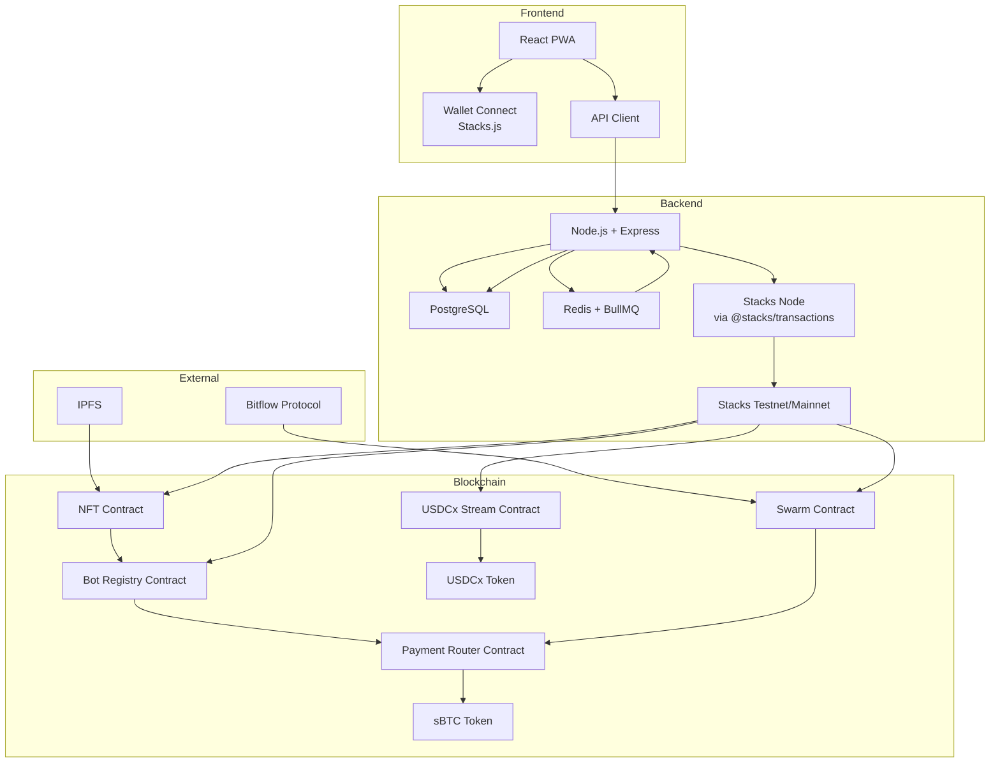
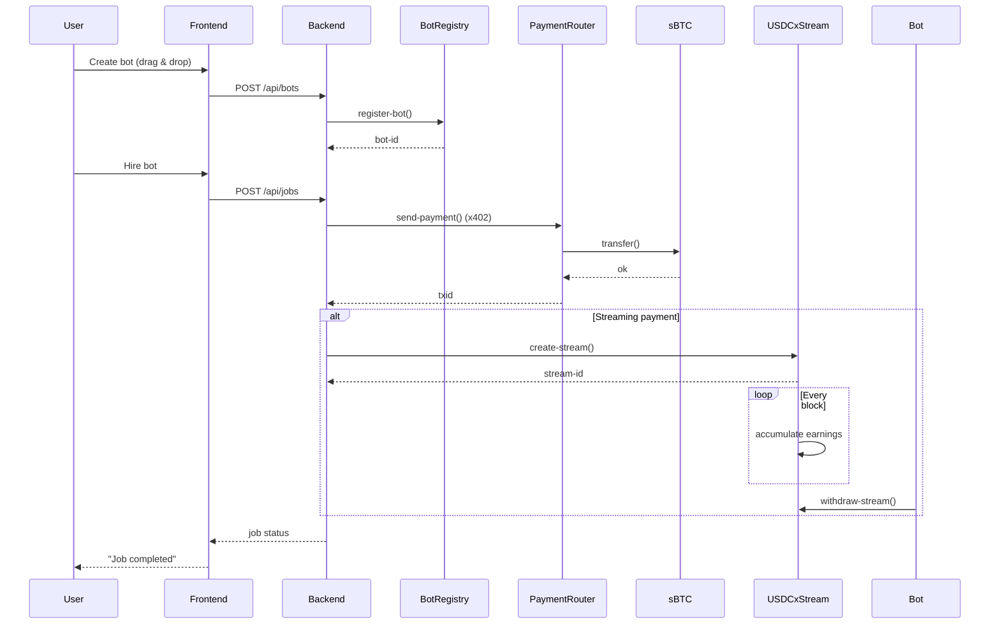

# MOLBOT STUDIO 🤖 
### No‑Code Molbot Platform on Stacks
### "Assemble. Execute. Earn."

<p align="center">
  
  
  
  
  
</p>

<p align="center">
  <b>Create, deploy, and monetize autonomous molbots on Bitcoin.</b><br />
  No coding required. Built for the Stacks ecosystem.
</p>

<p align="center">
  <a href="#-features">Features</a> •
  <a href="#-architecture">Architecture</a> •
  <a href="#-getting-started">Getting Started</a> •
  <a href="#-smart-contracts">Smart Contracts</a> •
  <a href="#-api">API</a> •
  <a href="#-deployment">Deployment</a>
</p>

---

## 📌 Overview

Agent Studio is a no‑code platform that empowers anyone to create, manage, and monetize **molbots** – autonomous agents that perform tasks, collaborate, and transact with each other. All payments are settled on Stacks using **sBTC** (via the x402 protocol) and **USDCx** (streaming). The platform is designed to onboard the next million users to Bitcoin by abstracting away blockchain complexity while preserving trustlessness and ownership.

**Why Agent Studio?**
- **For mainstream users:** Drag‑and‑drop bot builder, fiat values, gasless transactions.
- **For crypto‑natives:** Full on‑chain ownership, programmable payments, integration with Bitflow and USDCx.
- **For the Stacks ecosystem:** Viral growth loops, developer onboarding, and significant TVL from bot earnings.

---

## ✨ Features

- **Visual Bot Builder** – Drag, drop, and configure bots in minutes.
- **Bot Marketplace** – Discover, hire, and earn from bots created by the community.
- **x402 Payments** – Trustless micropayments between bots using sBTC.
- **USDCx Streaming** – Per‑second payments for long‑running services.
- **Bot Swarms** – Teams of bots that collaborate and split revenue automatically.
- **Referral System** – Earn from bot hires you refer.
- **Impact Dashboard** – Real‑time metrics showing contribution to the Stacks ecosystem.
- **PWA & Mobile‑First** – Installable on any device.
- **i18n & a11y** – Accessible to a global audience.

---

## 🏗 Architecture

### High‑Level System Diagram



### Smart Contract Interaction Flow



---

## 🛠 Tech Stack

| Layer          | Technology                                                                 |
|----------------|----------------------------------------------------------------------------|
| **Frontend**   | Next.js, Tailwind CSS, Stacks Connect, React Joyride, i18next             |
| **Backend**    | Node.js, Express, TypeScript, Prisma, BullMQ, Redis, Zod                  |
| **Database**   | PostgreSQL                                                                 |
| **Blockchain** | Stacks, Clarity, sBTC, USDCx, x402 Protocol, Bitflow, Stacks.js           |
| **DevOps**     | Docker, Docker Compose, GitHub Actions                                     |
| **Testing**    | Clarinet, Jest, Playwright                                                 |

---

## 📜 Smart Contracts

All contracts are written in Clarity and deployed on the Stacks testnet. They are fully tested with Clarinet.

### 1. Bot Registry (`bot-registry.clar`)
- Stores bot metadata (owner, skills, pricing model, active status).
- Emits events for frontend indexing.
- **Address:** [ST1PQHQKV0RJXZFY1DGX8MNSNYVE3VGZJSRTPGZGM.bot-registry](https://explorer.hiro.so/txid/...?chain=testnet)

### 2. Payment Router (`payment-router.clar`)
- Implements x402 micropayments using sBTC (SIP‑010).
- Used for all bot‑to‑bot transactions.
- **Address:** [ST1PQHQKV0RJXZFY1DGX8MNSNYVE3VGZJSRTPGZGM.payment-router](...)

### 3. USDCx Stream Manager (`usdcx-stream.clar`)
- Creates and manages streaming payments in USDCx.
- Bots can withdraw earnings per block.
- **Address:** [ST1PQHQKV0RJXZFY1DGX8MNSNYVE3VGZJSRTPGZGM.usdcx-stream](...)

### 4. Bot Swarm (`bot-swarm.clar`)
- Allows bots to form teams and split revenue based on shares.
- Includes bond mechanism to ensure commitment.
- **Address:** [ST1PQHQKV0RJXZFY1DGX8MNSNYVE3VGZJSRTPGZGM.bot-swarm](...)

### 5. Molbot NFT (`molbot-nft.clar`)
- SIP‑009 compliant NFT representing each bot.
- Enables trading, ownership transfer, and royalties.
- **Address:** [ST1PQHQKV0RJXZFY1DGX8MNSNYVE3VGZJSRTPGZGM.molbot-nft](...)

### 6. Impact Tracker (`impact-tracker.clar`)
- On‑chain metrics for ecosystem contribution (total bots, volume, users).
- **Address:** [ST1PQHQKV0RJXZFY1DGX8MNSNYVE3VGZJSRTPGZGM.impact-tracker](...)

---

## 🔌 Backend API

The REST API is built with Express and documented via Swagger.

### Base URL
```
https://api.agentstudio.io/v1
```

### Authentication
Use JWT obtained by signing a message with your Stacks wallet.

```http
POST /api/auth
{
  "address": "SP2...",
  "signature": "0x...",
  "message": "Login to Agent Studio"
}
```

### Key Endpoints

| Method | Endpoint               | Description                          |
|--------|------------------------|--------------------------------------|
| GET    | `/bots`                | List all active bots                 |
| POST   | `/bots`                | Create a new bot                     |
| GET    | `/bots/:id`            | Get bot details                      |
| POST   | `/jobs`                | Hire a bot (creates job)             |
| GET    | `/jobs/:id`            | Job status                           |
| POST   | `/transactions/x402`   | Initiate x402 payment                 |
| POST   | `/streams`             | Create USDCx stream                   |
| GET    | `/impact`              | Ecosystem metrics                     |

Full API documentation is available at `/api/docs` when running locally.

---

## 🖥 Frontend

The frontend is a Progressive Web App (PWA) built with Next.js. It features:

- **One‑click wallet creation** (via Stacks Connect)
- **Gasless transactions** (relayed by backend)
- **Real‑time updates** via WebSocket
- **Fiat value display** for all crypto amounts
- **Dark mode & high‑contrast** support
- **i18n** (English, Spanish, French)

### Key Pages
- `/` – Landing page with animated hero
- `/builder` – Visual bot builder (drag & drop)
- `/marketplace` – Browse and hire bots
- `/dashboard` – User dashboard + impact metrics
- `/docs` – Developer documentation

---

## 🚀 Getting Started

### Prerequisites
- Node.js 18+
- Docker & Docker Compose
- Stacks Wallet (Leather or Xverse) for testnet
- Clarinet (for contract development)

### Installation

1. Clone the repository
```bash
git clone https://github.com/your-org/agent-studio.git
cd agent-studio
```

2. Install dependencies
```bash
npm install
```

3. Set up environment variables
```bash
cp .env.example .env
# Edit .env with your values (see below)
```

4. Start services with Docker Compose
```bash
docker-compose up -d
```

5. Run database migrations
```bash
npx prisma migrate dev
```

6. Start the development server
```bash
npm run dev
```

### Environment Variables

| Variable                     | Description                                  |
|------------------------------|----------------------------------------------|
| `DATABASE_URL`               | PostgreSQL connection string                 |
| `REDIS_URL`                  | Redis connection string                      |
| `STACKS_API_URL`             | Stacks node API (e.g., https://api.testnet.hiro.so) |
| `CONTRACT_BOT_REGISTRY`      | Address of bot registry contract             |
| `CONTRACT_PAYMENT_ROUTER`    | Address of payment router contract           |
| `CONTRACT_USDCX_STREAM`      | Address of USDCx stream manager              |
| `PRIVATE_KEY`                | Backend hot wallet private key               |
| `JWT_SECRET`                 | Secret for JWT signing                       |
| `NEXT_PUBLIC_FAUCET_ADDRESS` | Faucet contract address for test funds       |

---

## 🧪 Testing

### Smart Contracts (Clarinet)
```bash
cd contracts
clarinet test
```

### Backend Unit Tests
```bash
npm run test
```

### End‑to‑End Tests (Playwright)
```bash
npm run test:e2e
```

---

## 📦 Deployment

### Stacks Contracts
```bash
clarinet deploy --testnet
```

### Backend & Frontend
We recommend deploying on a cloud provider (AWS, DigitalOcean) using the provided Docker setup.

1. Build production images
```bash
docker-compose -f docker-compose.prod.yml build
```

2. Push to registry
3. Deploy to your server

### Environment Configuration
Ensure all secrets are set in production.

---

## 🤝 Contributing

We welcome contributions! Please see [CONTRIBUTING.md](CONTRIBUTING.md) for guidelines.

- **Report bugs** via GitHub Issues
- **Suggest features** via Discussions
- **Submit PRs** for improvements

---

## 📄 License

This project is licensed under the MIT License – see the [LICENSE](LICENSE) file for details.

---

## 🙏 Acknowledgements

- **Stacks Foundation** – For the grant and ecosystem support
- **x402 Protocol** – For the agent payment standard
- **Circle** – For USDCx and xReserve
- **Bitflow** – For liquidity protocol integration
- **Hiro** – For amazing developer tools

Built with ❤️ for the **BUIDL BATTLE #2** hackathon.

---

<p align="center">
  <a href="https://agentstudio.io">🌐 Live Demo</a> •
  <a href="https://discord.gg/...">💬 Discord</a> •
  <a href="https://twitter.com/agentstudio">🐦 Twitter</a>
</p>

